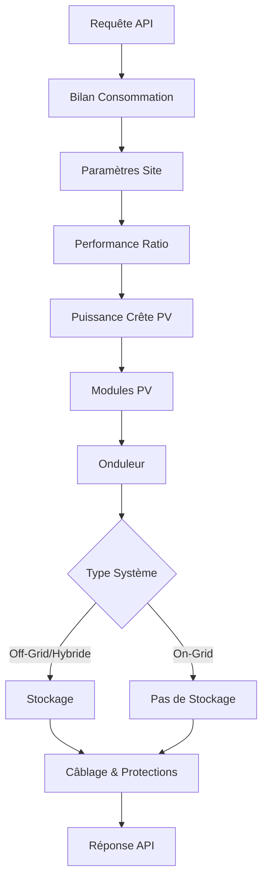

# Logique du Dimensionnement Photovoltaïque - Algorithme et Implémentation

## Vue d'Ensemble

Ce document décrit la logique algorithmique du système de dimensionnement photovoltaïque SelfSolar, implémentée dans les services TypeScript. L'approche suit une séquence déterministe basée sur les normes internationales (NFC 15-100, IEC 61215, IEC 62109, etc.), intégrant calculs physiques, données météorologiques et contraintes techniques pour produire un dimensionnement optimal et sécurisé.

### Architecture Logicielle

Le dimensionnement est orchestré par `InstallationPhotovoltaiqueController.dimensionnerInstallation()`, qui enchaîne séquentiellement les services :



Chaque service applique des formules normées avec validations et corrections environnementales.

## Étapes du Dimensionnement

Le processus suit une séquence logique, orchestrée par les services logiciels développés, basée sur les normes internationales.

### 1. Bilan de Consommation Électrique

**Service** : `BilanConsommationService` (`bilanConso.services.ts`)

**Objectif** : Quantifier la demande énergétique journalière et de crête.

**Algorithme** :

1. **Énergie totale journalière** :
   \[
   E_{\text{charge}} = \sum_{i=1}^{n} (P_i \times h_i \times k_{s,i})
   \]
   - \(P_i\) : Puissance nominale équipement \(i\) (W)
   - \(h_i\) : Heures utilisation journalière (h/j)
   - \(k_{s,i}\) : Facteur simultanéité (0-1, NFC 15-100 §771)

2. **Puissance apparente de crête** :
   \[
   P_{\text{crête}} = \left( \sum_{i=1}^{n} (P_i \times k_{s,i}) \right) \times K_f
   \]
   - \(K_f\) : Facteur foisonnement global (0.6-1.0, défaut 0.8)

**Validations** :
- \(E_{\text{charge}} > 0\) sinon erreur "Consommation nulle"
- Coefficients dans plages réalistes (0 < ks ≤ 1)

**Justification Physique** : Les équipements domestiques/industriels n'opèrent pas simultanément à 100%. Les coefficients \(k_s\) et \(K_f\) modélisent la diversité temporelle des usages.

### 2. Paramètres du Site Solaire

**Service** : `ParametresSiteService` (`parametreSite.services.ts`)

**Objectif** : Déterminer l'exposition solaire et orientation optimale.

**Algorithme** :

1. **Angle d'inclinaison optimal** (méthode simplifiée, p.4 guide) :
   ```typescript
   if (absLat < 15) angle = (absLat * 0.9) + 1;
   else if (absLat <= 25) angle = absLat;
   else angle = (absLat * 0.76) + 3.1;
   ```

2. **Données irradiation via PVGIS** :
   - API : `https://re.jrc.ec.europa.eu/api/v5.2/MRcalc`
   - Paramètres : `lat`, `lon`, `optimal=1` (angle optimal calculé)
   - Sortie : `H_h` (kWh/m²/j) pour chaque mois
   - **PSH défavorable** : Minimum mensuel pour dimensionnement conservateur

**Fallback** : Si API indisponible, estimation par latitude :
- < 20° : 4.5 h/j
- 20-35° : 4.0 h/j
- 35-50° : 2.5 h/j
- > 50° : 2.0 h/j

**Validations** :
- Coordonnées valides (-90/+90 lat, -180/+180 lon)
- Altitude pour déclassement si > 2000m

**Justification Scientifique** : L'irradiation suit des modèles météorologiques satellitaires. Le mois défavorable assure une production minimale garantie.

### 3. Performance Ratio et Pertes Système

**Service** : `PuissanceCretePVService.performanceRatio()` (`puissancePVCrete.services.ts`)

**Objectif** : Évaluer les pertes globales du système.

**Algorithme** :

1. **Pertes par type d'installation** :
   - `HAUTE_QUALITE` : 15-18%
   - `STANDARD` : 18-22%
   - `POUSSIEREUX` : 22-25%
   - `FAIBLE_MAINTENANCE` : 20-24%
   - `ANCIEN` : 25-30%
   - `CABLE_LONG` : 20-25%

2. **Performance Ratio** :
   \[
   PR = 1 - \frac{\text{Pertes totales}}{100}
   \]

**Facteurs de pertes** :
- Température modules (NOCT)
- Câblage (résistance, chute tension)
- Onduleur (MPPT, rendement)
- Poussière, vieillissement, orientation

**Justification** : Le PR (0.75-0.85) intègre toutes inefficacités réelles vs conditions STC idéales.

### 4. Puissance Crête PV Requise

**Service** : `PuissanceCretePVService.puissanceCretePV()`

**Objectif** : Calculer la puissance DC nécessaire.

**Algorithme** :

1. **Cas standard** :
   \[
   P_{\text{PV}} = \frac{E_{\text{charge}}}{\text{PSH} \times PR}
   \]

2. **Cas pompage solaire** :
   \[
   P_{\text{PV}} = \frac{E_{\text{hydraulique}}}{\text{PSH} \times \eta_{\text{onduleur}} \times PR}
   \]
   Avec \(E_{\text{hydraulique}} = \frac{Q \times H_{\text{man}} \times \rho \times g}{\eta_{\text{pompe}}}\)

**Paramètres pompage** :
- \(Q\) : Débit (m³/j)
- \(H_{\text{man}}\) : Hauteur manométrique (m)
- \(\rho, g\) : Constantes physiques
- \(\eta_{\text{pompe}}\) : Rendement pompe (0.65 typique)

**Validations** :
- Puissance > 0
- PSH > 0 (éviter division par zéro)

**Justification Physique** : La puissance doit compenser les pertes système et la variabilité solaire saisonnière.

### 5. Dimensionnement des Modules PV

**Service** : `PuissanceCretePVService.modulesPV()`

**Objectif** : Déterminer nombre et disposition des panneaux.

**Algorithme** :

1. **Température cellule (modèle NOCT)** :
   \[
   T_{\text{cell}} = T_{\text{amb}} + \frac{\text{NOCT} - 20}{800} \times G
   \]
   - \(G\) : Irradiance (W/m², défaut 1000)

2. **Corrections température** :
   - Tension : \(V = V_{\text{STC}} \times (1 + \beta \times (T_{\text{cell}} - 25))\)
   - Puissance : \(P = P_{\text{STC}} \times (1 + \gamma \times (T_{\text{cell}} - 25))\)
   - Courant : \(I = I_{\text{STC}} \times (1 + \alpha \times (T_{\text{cell}} - 25))\)

3. **Disposition strings** :
   - **On-grid/Hybride** : Respect plage MPPT onduleur
   - **Off-grid** : Tension système batterie (12/24/48V)
   - Nombre strings : \(\lceil \frac{P_{\text{PV}}}{P_{\text{module}} \times N_{\text{série}}}\rceil\)

4. **Vérifications sécurité** :
   - \(V_{\text{oc,string froid}} \leq V_{\text{max onduleur}}\)
   - \(V_{\text{mpp,string chaud}} \geq V_{\text{min MPPT}}\)
   - \(I_{\text{sc,total}} \leq I_{\text{max onduleur}}\)

**Validations** :
- Ns_min ≤ Ns ≤ Ns_max (plage MPPT)
- Températures dans plages module (-40/+85°C)

**Justification Électrotechnique** : Les modules forment un générateur DC dont la tension varie avec température. Les contraintes onduleur assurent fonctionnement MPPT optimal.

### 6. Vérification et Dimensionnement Onduleur

**Service** : `PuissanceCretePVService.onduleur()`

**Objectif** : Valider compatibilité et calculer ratio DC/AC.

**Algorithme** :

1. **Ratio DC/AC** :
   \[
   \text{Ratio} = \frac{P_{\text{DC crête}}}{P_{\text{AC nominale}}}
   \]
   - Cible : 1.15 (tropiques), limites [1.0-1.4]

2. **Vérifications** :
   - Tension MPPT : Vmpp_string ∈ [V_min, V_max]
   - Courant DC : I_sc_total ≤ I_max
   - Puissance DC : P_DC ≤ P_DC_max

3. **Gestion surcharge** :
   - Puissance pic : P_surcharge ≥ P_demarrage_moteurs

**Validations** :
- Ratio dans plage admissible
- Toutes vérifications "OK" sinon erreur

**Justification** : L'onduleur est l'interface critique entre DC solaire et AC réseau/consommation (IEC 62109).

### 7. Dimensionnement du Stockage

**Service** : `StockageService.capaciteStockage()` (`stockage.services.ts`)

**Objectif** : Calculer capacité batterie pour autonomie.

**Algorithme** :

1. **Capacité utile** :
   \[
   C_{\text{utile}} = E_{\text{charge}} \times N_{\text{autonomie}}
   \]

2. **Capacité nominale** :
   \[
   C_{\text{nominale}} = \frac{C_{\text{utile}}}{\text{DoD}_{\text{max}}}
   \]

3. **Dé-rating température (plomb-acide)** :
   - Si T > 25°C : C_nominale × (1 - 0.01 × (T - 25))

4. **Disposition modules** :
   - Série : \(\lceil \frac{U_{\text{système}}}{U_{\text{batterie}}}\rceil\)
   - Parallèle : \(\lceil \frac{C_{\text{totale}}}{C_{\text{batterie}}}\rceil\)

**Technologies** :
- **LiFePO4** : DoD 80-90%, cycles 2000-5000
- **AGM/Gel** : DoD 50-70%, cycles 800-1500
- **Plomb-acide** : DoD 50%, cycles 500-1000

**Validations** :
- Autonomie ≥ 1 jour
- Température dans plage technologie

**Justification Chimique** : Les batteries stockent énergie chimiquement. DoD limite préserve durée vie (IEC 62619).

### 8. Câblage et Protections Électriques

**Service** : `CablageEtProtectionsService` (`cablageProtection.services.ts`)

**Objectif** : Dimensionner câbles et protections pour sécurité et efficacité.

**Algorithme** :

1. **Section câbles DC** :
   \[
   S = \frac{\rho \times L \times I \times k_t \times k_g \times k_p \times k_m}{U \times \Delta U_{\text{max}}}
   \]
   - Facteurs correction : température (k_t), groupement (k_g), pose (k_p), matériau (k_m)

2. **Protections** :
   - **Fusibles string** : I_n = 1.25 × I_sc_string
   - **Disjoncteurs** : I_n ≥ I_emploi × 1.45
   - **Parafoudres** : Type 2, Up ≤ 2.0kV (IEC 61643-31)

3. **Câblage AC** :
   - Section selon NFC 15-100, chute ≤ 3%
   - DDR : Type B, sensibilité 300mA

**Validations** :
- Chute tension ≤ 3%
- Courants admissibles respectés
- Sélectivité protections vérifiée

**Justification Électrique** : Les câbles transportent puissance sans pertes excessives. Protections évitent surintensités et surtensions (NFC 15-100).

## Gestion des Erreurs et Robustesse

**Erreurs communes** :
- **Dimensionnement impossible** : Contraintes onduleur incompatibles (Ns_min > Ns_max)
- **Section insuffisante** : Chute tension > 3%
- **Température hors plage** : Module/batterie non adapté climat

**Fallbacks** :
- PVGIS indisponible → Estimations conservatrices
- Paramètres manquants → Valeurs défauts standardisées

**Optimisations** :
- Marge sécurité 10-20% sur puissance PV
- Évolution consommation future (+20%/an)
- Maintenance préventive (nettoyage annuel)

---

## Références Normatives

- **NFC 15-100** : Installations électriques basse tension
- **IEC 61215** : Modules photovoltaïques terrestres
- **IEC 62109** : Sécurité onduleurs
- **NF EN 50549** : Injection réseau
- **IEC 62619** : Batteries lithium-ion stationnaires
- **IEC 61643-31** : Parafoudres DC
- **ISO 8528** : Groupes électrogènes

---

## Perspectives d'Amélioration

**Techniques** :
- Intégration IA pour prédiction consommation
- Optimisation temps réel MPPT avancé
- Modèles météo haute résolution

**Scientifiques** :
- Simulation Monte Carlo pour incertitudes
- Modèles thermiques 3D modules
- Analyse cycle vie (LCA) composants

Cette logique assure un dimensionnement rigoureux, conforme et optimisé pour tous types d'installations PV.